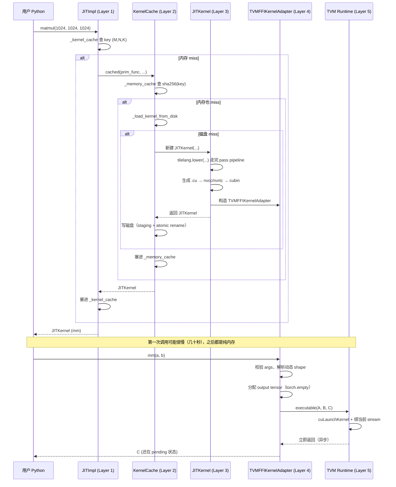

# 第 9 章 Runtime / JIT / Kernel Cache

> **TL;DR**：`@tilelang.jit` 之后，`matmul(...)` 的开销集中在**第一次**（编译 + 缓存）；之后每次调用都靠**多级缓存**（call-form 内存缓存 → KernelCache 内存/磁盘缓存）跳过编译，最终只剩"参数打包 + `cuLaunchKernel`"这点开销。理解这一章的关键就是分清哪些是"编译期一次性"的、哪些是"每次调用都跑"的。
>
> 前面 8 章讲的都是 **"怎么把 TIR 变成 .cu 文件、再变成 cubin"**。
> 这一章讲的是 **"编译出来的 cubin，怎么被 Python 里的 `matmul(a, b)` 这一次调用真正启动起来"**。
>
> 也就是回答一个非常具体的问题：
>
> ```python
> @tilelang.jit(out_idx=[-1])
> def matmul(M, N, K):
>     @T.prim_func
>     def kernel(A: T.Tensor((M, K), "float16"),
>                B: T.Tensor((K, N), "float16"),
>                C: T.Tensor((M, N), "float16")):
>         ...
>     return kernel
>
> mm = matmul(1024, 1024, 1024)   # ← 这里发生了什么？
> C = mm(a, b)                     # ← 这里又发生了什么？
> ```
>
> 第一行到底是 "编译 + 缓存 + 打包成对象" 的哪些步骤？第二行到底是 "取 stream、拿 device、malloc 输出、launch kernel" 的哪些步骤？本章把这两条链路彻底铺开。

---

## 9.1 从鸟瞰图开始：Runtime 层一共几层？

先建立整体图景，别陷进细节。TileLang 的 runtime 层严格分成 **5 层**：

```
用户代码                                      matmul(1024, 1024, 1024)(a, b)
  │
  ▼
┌──────────────────────────────────────────────────────────────────────┐
│ Layer 1  @tilelang.jit 装饰器                                        │
│   tilelang/jit/__init__.py::JITImpl                                  │
│   职责：Python 层参数解析、mode 推断 (lazy/eager)、call-form cache   │
└──────────────────────────────────────────────────────────────────────┘
  │  cached(...)
  ▼
┌──────────────────────────────────────────────────────────────────────┐
│ Layer 2  KernelCache（两级：内存 + 磁盘）                             │
│   tilelang/cache/kernel_cache.py::KernelCache                        │
│   职责：算 hash key → 内存查 → 磁盘查 → miss 才真正编译              │
└──────────────────────────────────────────────────────────────────────┘
  │  miss 时调用
  ▼
┌──────────────────────────────────────────────────────────────────────┐
│ Layer 3  JITKernel（一次真正的编译产物）                             │
│   tilelang/jit/kernel.py::JITKernel                                  │
│   职责：调 tilelang.lower(...) 走完 pass pipeline + 生成 cubin       │
│         选择 execution_backend（tvm_ffi / cython / nvrtc / ...）     │
└──────────────────────────────────────────────────────────────────────┘
  │
  ▼
┌──────────────────────────────────────────────────────────────────────┐
│ Layer 4  KernelAdapter（跨框架桥）                                    │
│   tilelang/jit/adapter/tvm_ffi.py::TVMFFIKernelAdapter                │
│   职责：把 torch.Tensor 变成 DLPack、绑 stream/device、launch cubin  │
└──────────────────────────────────────────────────────────────────────┘
  │
  ▼
┌──────────────────────────────────────────────────────────────────────┐
│ Layer 5  TVM Runtime                                                 │
│   tvm.runtime.Executable / tvm.runtime.Module                        │
│   职责：cuLaunchKernel、cudaMalloc、stream 同步、错误处理            │
└──────────────────────────────────────────────────────────────────────┘
```

> **关键直觉**：Layer 1-3 都是"编译期一次性"的事情；Layer 4-5 才是"每次调用都要跑一遍"的事情。
> 所以性能优化的重点是 **让 Layer 4-5 尽可能快**（少一次 Python 函数调用、少一次 tensor copy、避免多余的 stream 同步），而 Layer 1-3 只要**别重复做**就行——这就是为什么"缓存"是这一层的第一等公民。

> **术语说明**：上面图里的 "call-form cache" 对应源码里 `JITImpl` 的成员 `_call_form_cache`，指"直接拿原始调用参数 `(args, kwargs)` 当键的一级内存缓存"。这是源码里的真实成员名，不是通用行业术语，本书沿用它只是为了和源码对得上（详见 9.2.2）。

---

## 9.2 Layer 1: `@tilelang.jit` 装饰器发生了什么

打开 [tilelang/jit/\_\_init\_\_.py](../../tilelang/jit/__init__.py) 看装饰器的实现：

```python
def jit(func=None, *, out_idx=None, target=None, ..., pass_configs=None, ...):
    compile_args = dict(out_idx=out_idx, target=target, pass_configs=pass_configs, ...)

    def decorator(func):
        mode = "auto"
        pf: JITFunc = prim_func(func, eager_jit=True)   # ← 把普通 Python 函数包成 JITFunc
        func_source = inspect.getsource(pf.orig_func)
        signature = inspect.signature(pf.orig_func)
        return JITImpl(
            func=pf,
            **compile_args,
            func_source=func_source, signature=signature, mode=mode,
        )
    return decorator(func) if func is not None else decorator
```

装饰器**几乎什么都没做**——它只是把你写的 Python 函数包装成一个 `JITImpl` 对象。**真正的编译是在你第一次调用它的时候**才触发的。

### 9.2.1 两种执行模式（lazy vs eager）

TileLang 支持两种写法，装饰器会自动识别：

```python
# lazy 模式：函数返回 PrimFunc
@tilelang.jit(out_idx=[-1])
def matmul(M, N, K):
    @T.prim_func
    def kernel(...):
        ...
    return kernel                                # ← 显式 return PrimFunc

mm = matmul(1024, 1024, 1024)                    # 返回 kernel 对象
C  = mm(a, b)                                     # 手动 launch

# eager 模式：函数直接用 DSL 写、不 return
@tilelang.jit
def gemm(A, B, C, block_M: int = 64):
    M, N, K = T.const("M N K")
    A: T.Tensor[[M, K], "float16"]
    ...
    with T.Kernel(...):
        ...

gemm(A, B, C)                                     # 编译 + 立即执行
```

判定逻辑在 `JITImpl._infer_jit_mode`：如果 `func(*args, **kwargs)` 返回一个 `PrimFunc`，就是 lazy；否则用 DSL 构造器，就是 eager。这只是**同一个后端两种 UX 的糖衣**，底层完全一样。

### 9.2.2 调用链是怎么走的

`JITImpl.__call__` 里做的三件事（[jit/\_\_init\_\_.py](../../tilelang/jit/__init__.py)）：

```python
def __call__(self, *args, **kwargs):
    # 1) 若开启 call-form 缓存（lazy 模式 + 无 tensor 参数）
    if self.is_lazy_mode() and self._can_use_call_form_cache(has_tune_params):
        kernel, call_form_key = self._call_form_cache.lookup(args, kwargs)
        if kernel is not _CALL_FORM_CACHE_MISS:
            return kernel                       # ← 热路径：直接命中，什么都不做

    # 2) 用 (M, N, K, ...) 组一个 key，查内存 dict
    key, kernel_args = self.func.parse_args(*args, **kwargs)
    kernel = self._kernel_cache.get(key, None)
    if kernel is None:
        kernel = self.compile(*args, **kwargs)  # ← miss：真正编译
        self._kernel_cache[key] = kernel

    return kernel if self.mode == "lazy" else kernel(*kernel_args.values())
```

**三层内存缓存都发生在 `JITImpl` 一个对象里**：

| 层级 | 键 | 作用 |
|---|---|---|
| `_call_form_cache` | 原始 `(args, kwargs)` 元组 | 避免解析 args，最快 |
| `_kernel_cache` | `func.parse_args()` 归一化 key | 把 `matmul(1024,1024,1024)` 和 `matmul(M=1024,...)` 视为同一个 |
| `_tuner_cache` | 调优参数 | 给 autotuner 用 |

> **小白提示**：如果你在 hot loop 里反复调 `mm = matmul(1024, 1024, 1024)`，实际上第一次会真正编译，之后都是内存 dict `O(1)` 查找。所以放在循环里也不慢，别提前把它挪到循环外——`@tilelang.jit` 本身就是为这种用法设计的。

---

## 9.3 Layer 2: KernelCache——内存 + 磁盘两级缓存

Layer 1 的 `_kernel_cache` 只是"进程内的 dict"，进程一挂就没了。真正的**跨进程、跨 run 缓存**在 [tilelang/cache/kernel_cache.py](../../tilelang/cache/kernel_cache.py) 里的 `KernelCache` 类。

### 9.3.1 为什么需要磁盘缓存

一个中等规模的 flash-attention kernel，走完整个 lower + codegen + nvcc/nvrtc 的耗时大约是 **10~60 秒**。如果每次 `python demo.py` 都从头编译，做实验会痛苦到窒息。

所以 KernelCache 采用**两级架构**：

```
用户请求
   │
   ▼
   ┌────────────────────┐   命中
   │  内存 dict         │────────────► return 立即
   │  _memory_cache     │
   └────────────────────┘
   │ miss
   ▼
   ┌────────────────────┐   命中
   │  磁盘目录          │────────────► 从 .so + params.pkl 重建 JITKernel
   │  ~/.tilelang/cache │              → 塞进内存 dict
   └────────────────────┘
   │ miss
   ▼
真正编译（10~60s）→ 写磁盘 → 塞内存 dict → 返回
```

### 9.3.2 hash key 是怎么算的

**这是缓存正确性的命门**。key 算错了会导致："我改了 pass 代码，但缓存没失效，跑出的还是老 kernel"。

看 `_generate_key`：

```python
def _generate_key(self, func, out_idx, execution_backend, args, target, target_host,
                  pass_configs, compile_flags):
    func_binary = func.script(show_meta=True).encode()      # ← TIR 脚本文本
    key_data = {
        "func":              sha256(func_binary).hexdigest(),
        "out_idx":           tuple(out_idx) if ... else [out_idx],
        "args_repr":         tuple(repr(arg) for arg in args),
        "target":            str(target),
        "target_host":       str(target_host) if target_host else None,
        "execution_backend": execution_backend,
        "pass_configs":      pass_configs,
        "compile_flags":     compile_flags,
        **self._get_base_key(),                              # version（+ 可选的 libtilelang.so 内容 hash）
    }
    return sha256(json.dumps(key_data, sort_keys=True).encode()).hexdigest()
```

关注 `_get_base_key()` 里的这句：

```python
if env.should_use_kernel_cache_lib_stamp():
    lib_stamp = KernelCache._get_tilelang_lib_stamp()       # ← libtilelang.so 内容 hash
```

**这句话回答了一个非常隐蔽的坑**：如果 key 只依赖 TIR 脚本 + version 号，那么"在 C++ 层改了一个 pass 但没升版本号"时，缓存不会失效，跑出的还是旧行为——这就是那个非常经典的开发 bug：改完 pass 代码测试没变化，实际是缓存在骗你。

TileLang 支持把 `libtilelang.so` 的 **内容 SHA-256** 参与 key 来解决这个问题，但它是**可选项**：需要设 `TILELANG_KERNEL_CACHE_USE_LIB_STAMP=1` 打开（默认关闭）。做 C++ pass 开发时，要么打开这个开关，要么每次改完手动清缓存 / 用 `TILELANG_DISABLE_CACHE=1`。

> **给你自己写 pass 时的启发**：如果你在做 pass 开发，看到"改了没生效"，第一反应应该是：
> ```bash
> rm -rf ~/.tilelang/cache/kernels
> # 或者
> export TILELANG_DISABLE_CACHE=1
> ```
> 前者清缓存，后者临时关缓存。（`TILELANG_KERNEL_CACHE_USE_LIB_STAMP=1` 可以让 key 带上 libtilelang.so 的内容 hash，进一步防止"改了 C++ 没生效"，但如果你的开发流是 `pip install -e .` 用系统装的 tilelang，还是要小心。）

### 9.3.3 磁盘目录长什么样

一个 kernel 缓存对应一个目录：

```
~/.tilelang/cache/
  └── 0.1.12/linux-x86_64/          ← namespace（版本 + 平台）
      └── kernels/
          └── <sha256_key>/          ← 一个 kernel 一个目录
              ├── device_kernel.cu   ← 生成的 CUDA 源
              ├── host_kernel.cu     ← host wrapper（cython/nvrtc 用）
              ├── kernel_lib.so      ← 编译好的动态库
              ├── params.pkl         ← 通过 cloudpickle 序列化的 KernelParam
              └── resource_usage.json  (可选，HIP 才有)
```

### 9.3.4 并发安全：staging + atomic rename

真实场景下经常是**多个进程同时跑**（比如 `pytest -n auto` 或者一堆分布式训练 worker），如果两个进程同时编译同一个 kernel，怎么保证不写坏？

看 `_save_kernel_to_disk`：

```python
# 先在 staging 子目录里写完所有文件
staging_path = os.path.join(self._get_staging_root(),
                            f"{key}_{os.getpid()}_{uuid.uuid4().hex[:8]}")
os.makedirs(staging_path)
# ... 写 device_kernel.cu、host_kernel.cu、kernel_lib.so、params.pkl 全部落盘 ...

# 完整了再原子 rename 到目标位置
try:
    os.rename(staging_path, cache_path)
except OSError as exc:
    if not self._is_rename_collision(exc):
        raise
    shutil.rmtree(staging_path, ignore_errors=True)         # 别人先赢了 race
```

**关键设计**：
- 每个进程用**独立的 staging dir**（含 pid + uuid，绝不撞车）
- `os.rename` 在 POSIX 上是**原子操作**——别的进程要么看到不存在，要么看到完整目录，绝不会看到"写了一半的 kernel_lib.so"
- 如果两个进程同时编译并同时 rename，后到的会拿到 `EEXIST`，直接放弃自己的 staging——反正内容一样

这就是"**多进程安全的 kernel cache**"的通用模式。你以后自己写类似缓存也可以照抄这一套。

---

## 9.4 Layer 3: JITKernel——一次真正的编译

如果两级缓存都 miss，就进 `JITKernel.__init__`，这才是"真正编译一次"。核心逻辑在 [tilelang/jit/kernel.py](../../tilelang/jit/kernel.py) 的 `_compile_and_create_adapter`：

```python
with (jit_phase("lower", ...),
      tvm.transform.PassContext(opt_level=3, config=pass_configs, instruments=pass_instruments),
      self.target):
    artifact = tilelang.lower(
        tilelang_func,
        target=target, target_host=target_host,
        enable_host_codegen=enable_host_codegen,
        enable_device_compile=enable_device_compile,
    )
self.artifact = artifact
```

**`tilelang.lower()` 就是第 5 章讲过的那套 pass pipeline 的入口**。它返回一个 `CompiledArtifact`：

```python
@dataclass
class CompiledArtifact:
    host_mod:      tvm.IRModule       # host 侧代码
    device_mod:    tvm.IRModule       # device 侧 kernel
    params:        list[KernelParam]  # 参数元信息
    rt_mod:        tvm.runtime.Module # 已经编译好的动态库（tvm_ffi 后端）
    kernel_source: str                # 生成的 CUDA 源代码文本
```

然后根据 `execution_backend` 选一个 adapter 类去 wrap：

```python
if execution_backend == "tvm_ffi":
    adapter = TVMFFIKernelAdapter(
        params=artifact.params, result_idx=out_idx, target=target,
        func_or_mod=tilelang_func,
        host_mod=artifact.host_mod, device_mod=artifact.device_mod,
        rt_mod=artifact.rt_mod,                              # ← 已经就绪的 rt_mod
        device_kernel_source=artifact.kernel_source, ...
    )
elif execution_backend == "cython":     ...
elif execution_backend == "nvrtc":      ...
elif execution_backend == "cutedsl":    ...
```

### 9.4.1 有几种 execution_backend，各是干嘛的

看 [tilelang/backend/execution\_backend.py](../../tilelang/backend/execution_backend.py)：

| 后端 | 底层 | 特点 | 适用场景 |
|---|---|---|---|
| `tvm_ffi` | TVM 官方 FFI + DLPack | 最通用、依赖最少 | 默认，推荐 |
| `cython` | 编译一段 Cython wrapper | 少一次 Python↔C 调用，最快 | 生产环境 hot loop |
| `nvrtc` | NVIDIA NVRTC（运行时编 CUDA） | 不需要装 nvcc；启动快 | 快速调试 |
| `torch` | Metal / MPS | Apple 平台 | macOS |
| `cutedsl` | CUTLASS CuTe DSL | 直接输出 CuTe Python | 部分 gemm 变体 |

`resolve_execution_backend_spec(requested, target)` 的规则很直白：

```python
if requested_name in (None, "auto"):
    return allowed_available_specs[0]      # 用第一个可用的（注册顺序即优先级）

if requested_name not in allowed_all:
    raise ValueError("Invalid execution backend ...")  # 目标根本不支持这个后端

if requested_name not in allowed_available:
    raise ValueError("需要额外依赖但没装好 ...")
```

> **实用建议**：不用管这一层，`execution_backend="auto"` 就够了。只有你在 debug "为什么我的 kernel 在 A 机器跑得快、B 机器跑得慢"时，才需要显式指定后端来 A/B 对比。

---

## 9.5 Layer 4: TVMFFIKernelAdapter——每次调用都做的事

前面 Layer 1-3 都是**一次性**的。真正**每次 `mm(a, b)` 都会重跑一遍**的路径在 [tilelang/jit/adapter/tvm\_ffi.py](../../tilelang/jit/adapter/tvm_ffi.py)。

`_convert_torch_func()` 返回的那个 `func` 函数，就是最终暴露给用户的可调用对象。逐行读它：

```python
def func(*inputs: torch.Tensor | Any):
    # ─── (1) 参数校验 ───────────────────────────────────────
    expected_inputs = len(self.params) - len(self.result_idx)
    if len(inputs) != expected_inputs:
        raise ValueError(...)

    # ─── (2) 选 device：跟输入 tensor 的 device 走 ────────────
    out_device = next((inp.device for inp in inputs if isinstance(inp, torch.Tensor)), None)

    # ─── (3) 拼输入 + 分配输出 ────────────────────────────
    ins_idx = 0
    tensor_list = []
    for i in range(len(self.params)):
        if i in self.result_idx:                       # 是输出：这里要分配
            dtype = param_dtypes[i]
            shape = []
            for s in param_shapes[i]:
                if isinstance(s, tirx.Var):            # 动态 shape？去 dynamic_symbolic_map 查
                    ref_id, ref_tensor_idx, ref_shape_idx, stride_scale = dynamic_symbolic_map[s]
                    if ref_id == 0:                    # 从别的 tensor 的 shape 抠出来
                        shape.append(tensor_list[ref_tensor_idx].shape[ref_shape_idx])
                    elif ref_id == 1:                  # 从别的 tensor 的 stride 抠出来
                        shape.append(tensor_list[ref_tensor_idx].stride()[ref_shape_idx] * stride_scale)
                    elif ref_id == 2:                  # 是标量参数
                        shape.append(inputs[ref_tensor_idx])
                else:
                    shape.append(s)
            tensor = torch.empty(*shape, dtype=dtype, device=out_device)  # ← 这里 malloc
        else:                                          # 是输入
            tensor = inputs[ins_idx]
            ins_idx += 1
        tensor_list.append(tensor)

    # ─── (4) 拿到 executable（每 device 一份，惰性缓存） ─────
    executable = get_executable()

    # ─── (5) launch！───────────────────────────────────
    executable(*tensor_list)

    # ─── (6) 挑输出返回 ────────────────────────────────
    if len(self.result_idx) == 1:
        return tensor_list[self.result_idx[0]]
    return [tensor_list[i] for i in self.result_idx]
```

### 9.5.1 关键机制 1：动态 shape 是怎么解析的

看 `_process_dynamic_symbolic()`：

```python
for i, param in enumerate(params):
    if param in buffer_map:
        buffer = buffer_map[param]
        for j, shape in enumerate(buffer.shape):
            if isinstance(shape, tirx.Var) and (shape not in dynamic_symbolic_map) and (shape not in params):
                dynamic_symbolic_map[shape] = (0, i, j, 1)      # (类型=shape, 第i个tensor, 第j维)
```

**它就是在给"每个符号 M/N/K 到底从哪里读取"建一张表**。规则很直接："第一次看到符号变量 M 出现在第 i 个 tensor 的第 j 维，那 M 就等于 `inputs[i].shape[j]`"。

于是运行时用户调 `mm(a, b)` 时，adapter 就能自动从 `a.shape[0]` 推出 `M`、从 `a.shape[1]` 推出 `K`、从 `b.shape[1]` 推出 `N`，不需要用户手动传。

**stride_scale 那一行是 sub-byte dtype 的补丁**（`float4_e2m1fn` 之类）：这些 dtype 一个字节里放 2 个元素，PyTorch 的 stride 是 storage 单位而 kernel 里是逻辑元素单位，两者差一个 `8 // bits` 的比例。

### 9.5.2 关键机制 2：stream 和 device 是"惰性绑定"的

**这是易踩的坑，专门讲一下**。

初学者会想："既然 adapter 里要用 CUDA stream，那构造 adapter 时保存一下 `torch.cuda.current_stream()` 不就好了？"

**大错特错**。因为用户可能这样写：

```python
mm = matmul(1024, 1024, 1024)      # 在默认 stream 上构造
with torch.cuda.stream(other_stream):
    C = mm(a, b)                    # 希望在 other_stream 上跑
```

如果 adapter 构造时就绑死了默认 stream，用户的 `torch.cuda.stream(other_stream)` 就白写了。

TVMFFIKernelAdapter 的做法是**保存一个 thunk（可调用对象）而不是保存值**：

```python
def _convert_torch_func(self):
    current_device_functor = self.get_current_device_functor()   # ← 保存的是"取 device 的方法"

    def func(*inputs):
        ...
        if out_device is None:
            out_device = current_device_functor()                # ← 调用时才求值
```

> **给你写 CUDA runtime 库的启示**：**永远保存"如何取 stream/device"，而不是"当前 stream/device"**。这个 pattern 在 PyTorch + CUDA 混编里非常重要。

### 9.5.3 关键机制 3：每 device 一份 executable

看这段：

```python
def get_executable():
    if self.executable is not None:
        return self.executable

    device_key = "cpu"
    if torch.cuda.is_available():
        device_key = torch.cuda.current_device()

    executable = self._executables_by_device.get(device_key)
    if executable is not None:
        return executable

    with self._executable_lock:                                  # 线程锁保护
        executable = self._executables_by_device.get(device_key)
        if executable is None:
            executable = self._make_executable()
            self._executables_by_device[device_key] = executable
        return executable
```

**为什么每张卡要一个独立的 executable？**——因为 CUDA context 是**per-device** 的，`cudaModuleLoad` 也是 per-device 的。在 GPU0 上加载的 cubin 到了 GPU1 就得重新 load。所以 adapter 里维护一个 `dict[device_id, executable]`，第一次访问某张卡时惰性创建。

`threading.Lock` 是为了防止两个线程同时初始化同一张卡的 executable。

---

## 9.6 Layer 5: TVM Runtime 的一次 launch 到底做了什么

`executable(*tensor_list)` 这一行调用的是 `tvm.runtime.Executable.__call__`。往下就是 TVM 官方 runtime 了，简述一下发生的事：

```
executable(A, B, C)                        # Python 层
   │
   ▼
tvm.runtime.Executable.__call__
   │  1. torch.Tensor → DLPack pointer
   │  2. 读当前 stream（用户设置的或默认的）
   │  3. 打包 PackedFunc 的参数：[buffer 指针, shape, stride, ...]
   ▼
调用 host_mod 里的 host wrapper 函数           # 就是第 8 章生成的 __call_packed_func
   │  4. 从 args 里解出各个 tensor 的 data_ptr
   │  5. 计算符号 shape（M/N/K）
   │  6. 计算 grid/block（persistent kernel 里 grid=SM 数）
   ▼
调用 device_mod 里的 __global__ kernel        # cuLaunchKernel
   │  7. 各 warp/warpgroup 开跑
   │  8. 结果写回 output tensor buffer
   ▼
返回 Python                                   # 输出 tensor 已经就绪（在 GPU 上，异步）
```

上面图里第 1 步"torch.Tensor → DLPack pointer"听起来抽象，其实可以亲手看一眼——DLPack 是框架间零拷贝共享 tensor 的标准协议，`torch` 原生就支持：

```python
import torch
from torch.utils import dlpack

a = torch.randn(4, 4, device="cuda", dtype=torch.float16)
cap = dlpack.to_dlpack(a)          # torch.Tensor → DLPack capsule（零拷贝，只传指针+元信息）
b = dlpack.from_dlpack(cap)        # 再还原回一个 tensor
assert b.data_ptr() == a.data_ptr()  # 同一块显存，没有发生拷贝
```

TileLang 的 adapter 在每次 launch 时做的就是这件事：不拷贝数据，只把 tensor 的 data pointer / shape / stride 通过 DLPack 交给底层 kernel。所以 launch 的开销极小。

**注意 9.6 数据流图的最后一行**：`executable(A, B, C)` 是 **异步** 的（就像 PyTorch 的 CUDA op 一样）。返回时 kernel **可能还没跑完**，只是已经 enqueue 到 stream 上。要等结果同步，走 PyTorch 常规套路：

```python
C = mm(a, b)
torch.cuda.synchronize()    # 或者 C.cpu()、或者被下游 op 依赖时自动等
```

---

## 9.7 端到端时序图：把 5 层串起来



---

## 9.8 一些实用技巧

### 9.8.1 想看编译出来的 CUDA 源怎么办

```python
mm = matmul(1024, 1024, 1024)
print(mm.get_kernel_source())            # device kernel source
print(mm.get_host_source())              # host wrapper source
mm.show_source(which="both")             # 两个都打印
mm.export_sources(kernel_path="/tmp/k.cu", host_path="/tmp/h.cc")
```

### 9.8.2 想看 PTX/SASS 怎么办

```python
mm.show_ptx()                # 打印
mm.export_ptx("/tmp/k.ptx")  # 导出

mm.show_sass()               # 反汇编
mm.export_sass("/tmp/k.sass")
```

**看 SASS 是判断"pass 有没有真的生效"的最后一道保险**：Python 层看不出来的 issue（比如寄存器 spill），一看 SASS 立刻现形。

### 9.8.3 想让缓存 miss 强制重编怎么办

```bash
# 方法一：临时关缓存
export TILELANG_DISABLE_CACHE=1

# 方法二：清缓存
rm -rf ~/.tilelang/cache/kernels
# 或
python -c "from tilelang.cache import _dispatch_map; \
           [c.clear_cache() for c in _dispatch_map.values()]"
```

### 9.8.4 想看这次编译走了哪些 pass 怎么办

```python
import tvm

with tvm.transform.PassContext(
    opt_level=3,
    config={"tl.enable_dump_ir": True, "tl.dump_ir_dir": "/tmp/dump"},
):
    mm = matmul(1024, 1024, 1024)

# /tmp/dump/ 下会有 00_xxx.py、01_xxx.py，每个 pass 前后一个 IR 快照
```

（这个功能在 `JITKernel._compile_and_create_adapter` 里通过 `DumpIR` instrument 挂上去，第 4 章讲过。）

### 9.8.5 并行编译很多 kernel

```python
kernels = tilelang.par_compile(
    funcs=[my_gemm(M, N, K) for (M, N, K) in configs],
    num_workers=8,
)
```

底层就是 `concurrent.futures.ThreadPoolExecutor` + 你已经理解的两级缓存，所以第二次跑同样的 configs 是秒开。

---

## 9.9 常见"我以为的 vs 实际的" 对照表

| 我以为的 | 实际的 |
|---|---|
| `@tilelang.jit` 装饰器就会立刻编译 | ❌ 装饰器只是包一层 `JITImpl`，第一次调用才编 |
| 每次调 `mm(a, b)` 都会重编 | ❌ 只在第一次调用 `matmul(M,N,K)` 时编，之后 dict 查 |
| 缓存只在内存 | ❌ 内存 + `~/.tilelang/cache/` 磁盘双层 |
| 改了 C++ 层 pass 缓存一定会失效 | ⚠️ 不一定。只有开了 `TILELANG_KERNEL_CACHE_USE_LIB_STAMP=1`（默认关）才会把 `libtilelang.so` 内容 hash 加进 key |
| 磁盘缓存不能多进程共用 | ❌ 用 staging + atomic rename，多进程安全 |
| kernel 会绑死构造时的 stream | ❌ stream/device 都是 thunk，调用时惰性求值 |
| `mm(a, b)` 返回时 kernel 已经跑完 | ❌ 是异步的，就像 PyTorch 其他 CUDA op |
| 多张卡共享一个 executable | ❌ per-device 一份，惰性创建，线程安全 |

---

> ⚠️ **常见误解**
>
> - **"我改了 C++ pass，重跑就会用上新代码"** —— 不一定！默认缓存 key **不包含** `libtilelang.so` 的内容 hash，所以只要 TIR + target + configs 没变，缓存就命中、跑的还是旧行为。做 C++ pass 开发时**要么开 `TILELANG_KERNEL_CACHE_USE_LIB_STAMP=1`，要么每次 `TILELANG_DISABLE_CACHE=1` / 手动清缓存**。这是新手最爱踩的"改了没生效"坑。
> - **"`kernel(a, b)` 返回了就等于算完了"** —— 没有。launch 是**异步**的（和 PyTorch 的 CUDA op 一样），返回时 kernel 可能还在 GPU 上跑。要拿到确定结果得 `torch.cuda.synchronize()` 或被下游 op 依赖时自动等（见 9.6）。
> - **"把 `matmul(1024,1024,1024)` 提到循环外能省时间"** —— 基本没必要。`@tilelang.jit` 的多级缓存已经保证第二次起就是 `O(1)` 的 dict 查找，放循环里也不会重编（见 9.2.2）。

## 9.10 本章小结

- **JIT 装饰器**只是把函数包成 `JITImpl` 对象；真正编译发生在**第一次调用**。
- **JITImpl** 里维护了三层内存缓存（call-form / kernel / tuner），全部是进程内 `dict`。
- **KernelCache** 提供进程外持久化，用 `sha256(TIR + target + configs)` 做 key（**可选**再把 `libtilelang.so` 的内容 hash 加进去，需 `TILELANG_KERNEL_CACHE_USE_LIB_STAMP=1`，默认关），用 staging + atomic rename 保证多进程安全。
- **JITKernel** 是"一次真正编译的产物"，内部持有 `CompiledArtifact` + 一个 `KernelAdapter`。
- **TVMFFIKernelAdapter** 处理运行时的所有琐事：动态 shape 解析、per-device executable 缓存、stream/device 惰性绑定、malloc 输出 tensor。
- **TVM runtime** 才是真正的 `cuLaunchKernel`。

**记住一句话**：*"编译是一次，launch 是每次；两者的性能优化目标完全不同。"*

- 想缩短"第一次编译"的墙钟时间 → 优化 pass、加缓存、并行编译。
- 想缩短"每次 launch"的开销 → 优化 adapter（少一次 Python 调用、少一次 dtype 转换）、优化生成的 CUDA 代码本身。

下一章我们回到"开发者视角"，讲**怎么给 TileLang 自己写一个 pass、怎么调试、怎么发 PR 并让它通过 review**——这也是我们前几章一直在做的事情。

---

**上一章**：[第 8 章 Codegen：TIR → CUDA 源 → cubin](./08_codegen_tir_to_cuda.md)　·　**下一章**：[第 10 章 写 Pass / 调试 / 贡献工作流](./10_contribute.md)
