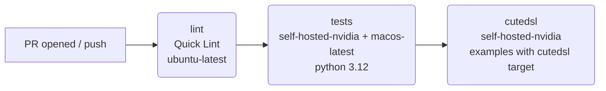
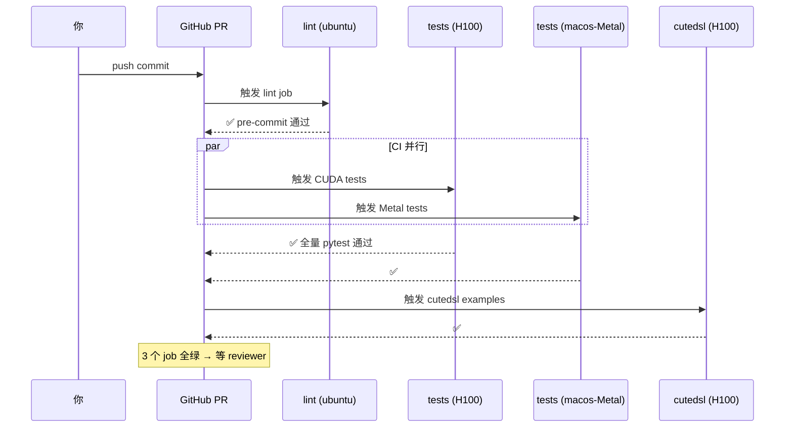

# 第 10 章 · 写 Pass / 调试 / 贡献工作流

> **TL;DR**：给 TileLang 贡献代码最典型的闭环是"**复现 → 用切片法定位到某个 pass → 最小改动修 → 加一个'删了就红'的回归测试 → 过 CI**"。本章把这条闭环连同环境、pass 的两种落法（Python 侧 / C++ 侧）、IR 切片调试一次走通。
>
> **本章目标**：让你能自己动手改 TileLang——从环境搭建、加一个 pass、加测试、跑 lint、发起 PR、看 CI，到最后把一个"修 pass bug"的完整闭环走一遍。
>
> 前 9 章我们一直在"读"编译器；这一章我们"写"编译器。

学到这里，你应该已经有的直觉：

- TileLang 前端是 Python DSL（第 3 章）
- 中间表示是 TVM 的 TIR（第 2 章）
- 编译过程是一串 pass（第 4、5 章）
- 有一些 pass 特别重要：Pipeline / WarpSpecialize（第 6 章）、Layout（第 7 章）
- 后端出 CUDA、由运行时缓存 & JIT 起来（第 8、9 章）

那"贡献 TileLang"最典型的形态就是：**发现某个 pass 在某个形态下行为不对 → 改这个 pass → 加测试 → 提 PR**。

本章就沿着这条主线走。

---

## 10.1 提 PR 之前：环境、格式化、Lint

TileLang 官方对贡献者的**唯一权威说明**在仓库根目录：[CONTRIBUTING.md](../../CONTRIBUTING.md)。这一节我们把它翻译成一个"照着做就行"的清单。

### 10.1.1 一次性搭好开发环境

```bash
# 1. Fork + clone（记得带 --recurse-submodules，TVM 是子模块）
git clone --recurse-submodules git@github.com:<your-username>/tilelang.git
cd tilelang
git remote add upstream git@github.com:tile-ai/tilelang.git

# 2. 建虚拟环境（推荐 uv，比 pip 快很多）
uv venv --seed .venv
source .venv/bin/activate
python3 -m pip install --upgrade pip setuptools wheel "build[uv]"
uv pip install --requirements requirements-dev.txt

# 3. 装 pre-commit hooks
pre-commit install --install-hooks

# 4. editable 安装（第一次会编译 C++，慢，之后只编增量）
python3 -m pip install --no-build-isolation --verbose --editable .
```

> 🧠 **"editable"是什么意思**
>
> 普通 `pip install .` 会把包**拷贝**到 `site-packages`，你改 Python 代码得重装。
> `pip install --editable .`（简称 `pip install -e`）只是在 `site-packages` 建一个**指针**指回你的源码目录，所以：
>
> - 改 **Python** 文件 → 立即生效
> - 改 **C++** 文件 → 需要重新编译；`--no-build-isolation` 保证增量编译（走 ccache）

### 10.1.2 格式化 & Lint：一条命令搞定

TileLang 的格式化脚本非常"体贴"，只处理"你改动过"的文件：

```bash
# 只格式化本次 diff 里改的文件（推荐 daily 用）
bash format.sh

# 只格式化指定文件（很快）
bash format.sh --files tilelang/transform/simplify.py

# 全仓库过一遍（改动巨大的 PR 才用，跑一次要几分钟）
bash format.sh --all
```

📄 **打开 [format.sh](../../format.sh) 你会发现它做的事情不多**：

1. 找出 `merge-base` 到 `HEAD` 之间改动的所有文件
2. 对这些文件跑一次 `pre-commit run`
3. 如果 pre-commit 改了任何东西，退出码非 0，让你 `git diff` 看下再 stage

所以真正在干活的是 pre-commit。在 [.pre-commit-config.yaml](../../.pre-commit-config.yaml) 里你能看到它挂了哪些 hook：

| Hook | 干什么 |
| --- | --- |
| `pre-commit-hooks`（trailing-whitespace / end-of-file-fixer / check-yaml / check-toml / check-ast / debug-statements ...） | 空白、换行、语法基本卫生 |
| `mirrors-clang-format` v22.1.5 | C/C++/CUDA 代码格式（版本要和 `requirements-lint.txt` 一致） |
| `ruff-pre-commit` v0.15.20 | Python lint（`ruff-check --fix`）+ 格式化（`ruff-format`） |
| `codespell` v2.4.2 | 拼写检查（跳过 `.cpp/.hpp/.cu/.cuh/.svg` 和 `requirements*.txt`） |
| `pymarkdown` v0.9.38 | Markdown 规范化 |

> 💡 **CI 会跑一次 `pre-commit run --all-files`**（见 [.github/workflows/ci.yml](../../.github/workflows/ci.yml) 的 `lint` job）。所以本地跑 `bash format.sh` 通过 = CI 的 lint job 一定通过。这一步是免费的门票，先过掉再干别的。

### 10.1.3 C++ 命名 & 头文件的额外规矩

C++ 侧还有一个专门的规范 [docs/developer_guide/cpp_style.md](../../docs/developer_guide/cpp_style.md)。**关键结论**（摘录到我们日常最容易碰到的几个点）：

| 场景 | 规矩 |
| --- | --- |
| 文件名 | `lower_snake_case`，例 `lower_tile_op.cc` |
| 类 / 结构体 / ObjectRef | `PascalCase`，例 `Layout`、`Fragment` |
| ObjectNode | `PascalCaseNode`，例 `LayoutNode`、`FragmentNode` |
| 函数 / 方法 | `PascalCase`，例 `InferLayout`、`FindPipelineLoop` |
| 布尔函数 | `Is` / `Has` / `Can` 前缀，例 `IsFragmentBuffer` |
| 参数 / 局部变量 | `lower_snake_case`，例 `layout_map`、`thread_bounds` |
| 私有成员 | 末尾加下划线，例 `analyzer_`、`layout_remap_` |
| 常量 / 枚举 | `k` + `PascalCase`，例 `kWarpSize`、`kAccessRead` |
| ObjectNode 的**公开反射字段** | `lower_snake_case` **不加**末尾下划线（因为它是 Python/FFI 可见名） |

三条最容易踩坑的红线：

1. **不要用 `T` 作参数名**——它在 TileLang 里已经是 Python DSL 命名空间，在 C++ 里又是 template type param，撞车严重。
2. **不要在 header 里 `using namespace ...`**——尤其是跨模块的 header。用 `namespace tvm { namespace tl { ... } }` 并显式限定 `ffi::Array`、`tirx::Buffer`。
3. **不要 `handle.get() == other.get()` 比较 ObjectRef**——用 `.same_as(other)`（身份）或 `StructuralEqual`（结构）。

仓库还给了一个 advisory 脚本，随手扫一下：

```bash
python3 maint/scripts/audit_cpp_api_style.py
```

CI 也会跑这个脚本（`Quick Lint` job 里叫 "C++ API Style Audit (warning only)"），但它是**警告不阻塞**——你不用为它加班，但看到自己新加的代码上榜就顺手改一下。

---

## 10.2 CI 里到底跑了什么？

打开 [.github/workflows/ci.yml](../../.github/workflows/ci.yml)，把 200 多行的噪音去掉，本质就三个 job：



各 job 干的事：

### `lint` — 15 分钟以内，人人都跑

```yaml
- Check AST with Python 3.10   # 保证 tilelang/ 能被 3.10 编译
- C++ API Style Audit          # 上一节讲过，warning-only
- Pre-commit Lint              # 上一节讲过
```

### `tests` — 主战场，2 小时预算

矩阵：CUDA-auto（self-hosted NVIDIA，通常 H100/H800）× Python 3.12，加一个 macOS Metal 分支。步骤按顺序是：

1. Setup CUDA / ccache / uv venv
2. `uv pip install -v .`（把整个 wheel 装好）
3. **两轮 pytest**：
   ```bash
   # 第一轮：examples
   pytest --numprocesses=8 --maxfail=3 ../examples

   # 第二轮：testing/python 全量
   pytest --numprocesses=8 --maxfail=3 ./python
   ```

⚠️ **注意 `--numprocesses=8`**——CI 用 `pytest-xdist` 并行跑 8 个 worker。这意味着**你新加的测试如果依赖全局单例（比如自己往 `/tmp` 写死一个固定文件名），大概率会 flaky**。

### `cutedsl` — 额外一轮 examples，用 cutedsl 后端

只有在 `tests` 通过后才跑（`needs: [tests]`）。它用 CuTeDSL 后端再重新过一遍 examples（例如设 `TILELANG_TARGET=cutedsl`，`examples/conftest.py` 会据此对已知不支持的用例自动 xfail）。**这解释了为什么 CI 排队跑一个 PR 会 4~6 小时**——两个不同后端各跑一次 examples。

📌 **实战建议**：本地能过 `lint` + `bash format.sh` + 直接相关的 `testing/python/transform/*.py` 单元测试，就可以先 push，让 CI 去帮你跑 CUDA + Metal + cutedsl。你的 24GB 显存跑不完全量。

---

## 10.3 写一个 Pass：从零到"能跑"

从第 4 章我们知道，pass 有两种落法：
- **Python 侧 pass**：`@tvm.tirx.transform.prim_func_pass`，纯 Python 遍历 TIR
- **C++ 侧 pass**：写 `StmtExprMutator` / `IRMutatorWithAnalyzer`，通过 FFI 注册

本节先讲 Python 版（门槛低、验证快），再讲什么时候必须落到 C++。

### 10.3.1 Python 版：一个"给所有 Buffer 打 tag"的 pass

假设我们要写一个玩具 pass：遍历 PrimFunc，把每个 `T.alloc_buffer` 出来的 buffer 的名字加个前缀 `[tag]`。

先看 TileLang 官方现成的模板——[tilelang/transform/simplify.py](../../tilelang/transform/simplify.py) 是全仓库最短的 pass wrapper（不到 60 行），照着抄就够：

```python
# tilelang/transform/simplify.py 关键结构
from tilelang import tvm as tvm
from tvm import IRModule
from tvm.tirx import PrimFunc
from . import _ffi_api          # ← 自动从 C++ 侧的 tl.transform.* FFI 拿函数

def Simplify(simplify_arguments: bool = False):
    return _ffi_api.Simplify(simplify_arguments)   # ← 真正的实现在 C++
```

这是"Python 只做壳、C++ 做实现"的写法。如果你的 pass **纯 Python** 就够，就照第 4 章那套
`@tirx.functor.mutator` + `PyStmtExprMutator` 的 API 写。下面这个玩具 pass 在 kernel body 外
包一层 `AttrStmt` 标记（结构最简单、不需要重建复杂节点，适合入门）：

```python
# tilelang/transform/tag_body.py（新文件，示例）
from __future__ import annotations
from tvm import tirx
from tvm.tirx import AttrStmt, PyStmtExprMutator, functor
from tvm.tirx.transform import prim_func_pass


@functor.mutator
class _TagBodyMutator(PyStmtExprMutator):
    def visit_evaluate_(self, op):
        # 这里只做一个"演示改写"：什么都不改，原样返回
        # 真实 pass 会在这里判断节点、构造并返回新节点
        return op


def TagBody():
    """在 PrimFunc body 外包一层 AttrStmt 标记（玩具示例）。"""

    def pass_fn(func, mod, ctx):
        mutator = _TagBodyMutator()
        new_body = mutator.visit_stmt(func.body)
        # 造一个新节点：给整段 body 挂一个 attr 标记
        new_body = AttrStmt(0, "tl.tagged", 1, new_body)
        return func.with_body(new_body)          # PrimFunc 不可变，用 with_body 造副本

    return prim_func_pass(pass_fn, opt_level=0)
```

用法（先拿到一个真实的 `IRModule` 再应用 pass）：

```python
import tilelang, tilelang.language as T
from tilelang import tvm as tvm

pf  = matmul.get_tir(**cfg)                       # cfg 见第 1 章
mod = tvm.IRModule({pf.attrs["global_symbol"]: pf})
mod = TagBody()(mod)                              # ← 应用我们的 pass
print(mod.script())                              # 观察 body 顶部多了一个 attr 标记
```

> 💡 **只用真实存在的 API**：本节全程走 `PrimFunc` / `IRModule` / `mod.script()` /
> `func.with_body(...)` 这些真实存在的接口。写 pass 时如果不确定某个方法在不在，先
> `dir(obj)` 或去源码里 grep 一下，别凭印象拼 API 名。

### 10.3.2 加进 pass pipeline

写完 pass **不代表它会被 lowering 用到**——第 5 章讲过，pass 是在 `CUDAPassPipelineBody`（[`tilelang/cuda/pipeline.py`](../../tilelang/cuda/pipeline.py)）里被一条条 `mod = SomePass()(mod)` 应用出来的。想让它生效，有两个入口：

**方式 A：自己在外面手动串**（推荐做实验用）

```python
mod = tilelang.transform.MaterializeKernelLaunch()(mod)
mod = TagBody()(mod)                   # ← 在你关心的位置手动插入
# ... 其余 pass 照 tilelang/cuda/pipeline.py 的顺序串下去
```

**方式 B：改进管线**（真的要贡献到主分支才这么做）

去 [`tilelang/cuda/pipeline.py`](../../tilelang/cuda/pipeline.py) 的 `CUDAPassPipelineBody`（或它调用的 `CUDAPassPipelineBodyPrologue`）里，在合适的位置塞一行：

```python
mod = TagBody()(mod)
```

⚠️ **位置很重要**——第 5 章讲过 pass 之间是有依赖顺序的。挂错位置轻则无效、重则崩。加新 pass 时永远先问：**"我依赖前面哪些 pass 的产物？我又会不会破坏后面某个 pass 的假设？"**

### 10.3.3 Python 还是 C++？

|  | Python pass | C++ pass |
| --- | --- | --- |
| 开发速度 | ✅ 秒级迭代 | ❌ 需要编译 |
| 调试友好度 | ✅ 直接 `print` / pdb | ❌ 得靠 `LOG(INFO)` |
| 性能 | ❌ 遍历大 IR 慢 | ✅ 快很多 |
| 能不能被 CI 拿去跑 | ✅ | ✅ |
| 能操作的 API | 只有 Python 暴露的一部分 | 全量 TVM C++ API |

**经验法则**：
- **原型验证 / bugfix POC** → 先写 Python 版跑通
- **正式提 PR** → 除非本来上下文已经在 Python 侧，否则改成 C++ 版
- 目前 tilelang/transform/ 下大多数 `.py` 都只是 C++ 实现的**壳**，这就是这个原因

---

## 10.4 C++ 侧写 Pass：骨架与常见坑

从第 4、5、6 章我们已经见过大量 C++ pass 的实际代码。这里把"写一个 C++ pass"的骨架和坑抽出来。

### 10.4.1 最小骨架

```cpp
// src/transform/my_pass.cc
#include <tvm/ffi/reflection/registry.h>
#include <tvm/tir/stmt_functor.h>
#include <tvm/tir/transform.h>

namespace tvm {
namespace tl {

using namespace tir;   // ← .cc 里可以，header 里禁止（cpp_style.md）

// 1. Mutator：真正干活的类
class MyPassMutator : public StmtExprMutator {
 public:
  Stmt VisitStmt_(const ForNode* op) final {
    For loop = GetRef<For>(op);                    // NodeRaw → Ref
    // ... 判断 & 重写 ...
    return StmtExprMutator::VisitStmt_(op);        // 兜底递归
  }
 private:
  arith::Analyzer analyzer_;                       // ← 私有成员带 _
};

// 2. Pass 入口：包装成 PrimFuncPass
namespace transform {

Pass MyPass() {
  auto pass_func = [](PrimFunc f, IRModule m, PassContext ctx) {
    auto* n = f.CopyOnWrite();
    n->body = MyPassMutator()(std::move(n->body));
    return f;
  };
  return CreatePrimFuncPass(pass_func, 0, "tl.MyPass", {});
}

// 3. 注册到 FFI，暴露给 Python 侧的 _ffi_api
TVM_FFI_STATIC_INIT_BLOCK({
  namespace refl = tvm::ffi::reflection;
  refl::GlobalDef().def("tl.transform.MyPass", MyPass);
});

}  // namespace transform
}  // namespace tl
}  // namespace tvm
```

对应的 Python 壳（照抄 `simplify.py`）：

```python
# tilelang/transform/my_pass.py
from . import _ffi_api

def MyPass():
    return _ffi_api.MyPass()
```

### 10.4.2 写 Mutator 时最容易踩的 3 个坑

1. **忘了 `same_as` 判空 `GetRef` 结果**
   ```cpp
   Optional<For> pipe = FindPipelineLoop(loop->body);
   if (pipe.defined() && pipe.value().same_as(loop)) { ... }
   ```
   如果直接 `if (pipe.value() == loop)` 会调用结构比较，慢且不是你想要的。

2. **`CopyOnWrite()` 用错**
   TVM 的 ObjectRef 是不可变的。想改一个 `PrimFuncNode` 的字段，唯一的方式是 `f.CopyOnWrite()->body = ...;`。如果直接 `const_cast` 或 `.get()->body = ...` 会破坏其他持有同一 ref 的地方。

3. **StmtMutator 忘了兜底递归**
   `VisitStmt_(const ForNode* op)` 里如果只处理"感兴趣"的分支，剩下的必须 `return StmtMutator::VisitStmt_(op);`——不然子树就再也不会被访问了，你会以为自己 pass 没生效，其实是根本没走到。

### 10.4.3 编译 & 加载

```bash
# 增量编译（编译过一次之后大部分改动只要 30~90s）
cd build && ninja tilelang

# 让 Python 立刻能 import 到新 pass（editable 装法自动加载）
python -c "from tilelang.transform import my_pass; print(my_pass.MyPass())"
```

如果 `_ffi_api.MyPass` 报 `AttributeError`，99% 是 **C++ 那侧的 `TVM_FFI_STATIC_INIT_BLOCK` 没被链接进来**——检查 `src/transform/CMakeLists.txt` 有没有把新 `.cc` 加进去。

---

## 10.5 调试三件套

写 pass 的时候 IR 到底长啥样？出错的时候到底哪一步炸了？下面这三个是你会用**几百次**的工具。

### 10.5.1 打印 IR

**任何时候你想看当前 IR，都可以：**

```python
print(mod.script())          # IRModule → TVMScript 文本
print(func)                  # PrimFunc → 同上
```

在 C++ 侧同样能打：

```cpp
LOG(INFO) << "after MyPassMutator:\n" << f;
```

TVMScript 是**可读也可回写**的——把打印结果保存成 `.py`，可以用 `tvm.script.from_source` 再解析回来。这是"复现 pass 输入"最快的路子。

### 10.5.2 单独跑某一步

从第 5 章我们知道，lowering 是一串 `mod = SomePass()(mod)`。要单独观察某一步的输入/输出，
就照 [第 5 章 5.6](./05_lowering_pipeline.md) 的模板手动把 pass 串到你关心的位置，在前后 `print(mod.script())`：

```python
import tilelang, tilelang.language as T
from tilelang import tvm as tvm
from tvm.target import Target

pf  = matmul.get_tir(**cfg)
mod = tvm.IRModule({pf.attrs["global_symbol"]: pf})
tgt = Target("cuda")

mod = tvm.tirx.transform.BindTarget(tgt)(mod)
mod = tilelang.transform.MaterializeKernelLaunch()(mod)
# ... 照 pipeline.py 的顺序串到 InjectSoftwarePipeline 之前 ...
mod = tilelang.transform.PipelinePlanning()(mod)
print("===== BEFORE InjectSoftwarePipeline =====")
print(mod.script())

mod = tilelang.transform.InjectSoftwarePipeline()(mod)
print("===== AFTER  InjectSoftwarePipeline =====")
print(mod.script())
```

排查 pass bug 时的常用做法就是这样"切片"：先把 lowering 停在可疑 pass 前，dump 出 IR，
再单独跑那一个 pass，对比前后的 `mod.script()`；必要时在 C++ pass 里加 `LOG(INFO)` 看它把 IR 变成了什么。

### 10.5.3 环境变量：无侵入日志

```bash
# 打开 TVM 底层的所有 DEBUG 日志（会非常多）
TVM_LOG_DEBUG=1 python your_kernel.py

# 禁用 JIT 缓存，强制每次重新编译（调 pass 时几乎必开）
TILELANG_DISABLE_CACHE=1 python your_kernel.py
```

想看生成的 CUDA 源码，用 API `kernel.get_kernel_source()`（第 8、9 章讲过）。第 9 章讲过
`TILELANG_DISABLE_CACHE=1` 会绕过 JIT cache——**调试 pass 的时候几乎必开**，否则你可能对着旧的 cubin 干瞪眼。

### 10.5.4 二分定位：pass 一半一半地关

新加 pass 之后 GEMM 结果变错？最快的定位方式是**从 pipeline 后面往前反注释**。第 5 章讲过 `CUDAPassPipelineBody` 里 pass 是显式排好序的，注释掉几行 → 重跑测试 → 二分。

---

## 10.6 加测试：pytest 布局与最小样例

TileLang 的测试都在 [testing/python/](../../testing/python)，按"改了什么就在哪里加"的原则组织：

| 你改的东西 | 测试放哪 |
| --- | --- |
| `tilelang/transform/xxx.py` 或 `src/transform/xxx.cc` | `testing/python/transform/test_tilelang_transform_xxx.py` |
| `tilelang/language/xxx.py`（新 DSL 原语） | `testing/python/language/test_tilelang_language_xxx.py` |
| kernel/端到端行为 | `testing/python/kernel/test_tilelang_kernel_xxx.py` |
| runtime / jit / cache | `testing/python/jit/`、`testing/python/runtime/` |

**测试模板**（照抄一份改改就好）：

```python
# testing/python/transform/test_my_pass.py
import tilelang
import tilelang.language as T
from tilelang import tvm as tvm
from tvm.tirx.transform import prim_func_pass


def _identity_pass():
    def pass_fn(func, mod, ctx):
        return func
    return prim_func_pass(pass_fn, opt_level=0)


@tilelang.jit
def add(A, B, block_N: int = 128):
    N = T.const("N")
    A: T.Tensor((N,), T.float32)
    B: T.Tensor((N,), T.float32)
    C = T.empty((N,), T.float32)
    with T.Kernel(T.ceildiv(N, block_N), threads=block_N) as bx:
        for i in T.Parallel(block_N):
            C[bx * block_N + i] = A[bx * block_N + i] + B[bx * block_N + i]
    return C


def _make_input():
    pf = add.get_tir(N=4096, block_N=128)
    return tvm.IRModule({pf.attrs["global_symbol"]: pf})


def test_my_pass_preserves_body():
    mod = _identity_pass()(_make_input())
    name = list(mod.functions.keys())[0]
    assert mod[name].body is not None


if __name__ == "__main__":
    tvm.testing.main()
```

跑测试：

```bash
# 只跑你新加的那个文件
pytest -xvs testing/python/transform/test_my_pass.py

# 跑整个 transform 目录（几十秒）
pytest testing/python/transform
```

⚠️ **`pytest-xdist` 并发注意点**：

- 测试之间**不要共享文件名**（例如 `open("/tmp/tilelang.log")`），并发跑会串
- 需要 GPU 的测试放到有 `@tilelang.testing.requires_cuda_compute_version(...)` 装饰器的位置——它会自动 skip 掉不满足硬件要求的 runner

---

## 10.7 PR 工作流：一次完整跑通

假设我们要修一个 bug：**"某个 pass 在 outer For 下面崩了"**。以下是最短闭环：

```bash
# 1. 分支
git checkout -b fix/my-pass-outer-for

# 2. 改代码 + 加测试
$EDITOR src/transform/my_pass.cc
$EDITOR testing/python/transform/test_my_pass.py

# 3. 增量编译 + 本地跑测试
cd build && ninja tilelang && cd ..
pytest -xvs testing/python/transform/test_my_pass.py

# 4. 格式化 + lint
bash format.sh
# 如果 format.sh 报 "Reformatted files"，把改动 stage 上
git add -u

# 5. 提交（TileLang 用普通 imperative message，不强制 conventional commits）
git commit -m "fix(my-pass): handle outer For correctly"

# 6. push 到你自己的 fork
git push origin fix/my-pass-outer-for

# 7. GitHub 上开 PR，指向 tile-ai/tilelang:main
```

**开 PR 后会发生什么**（这是 [.github/workflows/ci.yml](../../.github/workflows/ci.yml) 决定的）：



**Reviewer 一般看什么**：

1. **bug 复现是不是能锁住** — 你有没有加"如果这行代码删了、测试就红"的最小测试
2. **有没有引入回归** — 你的改动会不会让本来能过的 case 编不出来
3. **风格** — cpp_style.md 里那几条命名和头文件规矩
4. **是不是最小改动** — TileLang 拒绝"顺便重构一下"的大 diff

📌 **实战小 tip**：PR description 里贴上：

- 复现命令（`pytest -xvs testing/python/transform/test_xxx.py::test_yyy`）
- 改动前的 CUDA 输出片段 / 改动后的输出片段
- 如果是性能修复，贴 TFlops 对比

Reviewer 会明显地喜欢你。

---

## 10.8 案例复盘：排查一个真实的 pass bug

这是全书最后一段——把前 9 章讲的东西（DSL / pass pipeline / pipeline pass / warp specialize / mbarrier / IR mutator）串起来，走一遍"一个编译器 bug 从复现到合入"的完整闭环。这里以第 6 章那类
"Persistent + 深流水 + Warp Specialization 下 phase 对齐"的问题为例。

### 10.8.1 背景与症状

**症状**：一个用 `T.Persistent` + 深流水（`num_stages=3`）+ 带 guard 的 GEMM kernel，在 sm_90 上跑出错误结果——数值对，但一波（wave）之后就开始错。

**编译器视角**（对照第 6 章讲的 pipeline pass 就知道该看哪里）：

- `T.Persistent` 会展开成一个 outer For（外层 tile / wave 循环）
- 里面是 pipelined K-loop（`T.Pipelined(K, num_stages=3)`）
- 深流水会跑 `ProducerConsumerWarpSpecialized` pass 生成 mbarrier + producer/consumer 双分支

### 10.8.2 复现最小化

第一步永远是把报错减到最小——把三个特性（persistent + guard + `num_stages=3`）叠加成一个最小 kernel，能稳定复现即可。这个最小例子就是后续回归测试的骨架。

### 10.8.3 定位：用"切片"法找到出错的 pass

用 **10.5.2 的"切片"技巧**在 pass pipeline 里一步步 dump IR，对比"上一 pass 还对、这个 pass 后就错"，就能把问题锁定到某个具体 pass（本例是 `ProducerConsumerWarpSpecialized`）。这类问题的根因通常落在下面几类：

1. **结构性问题** — 负责"找到 pipeline loop"的 `StmtVisitor` 只 override 了部分节点类型（比如只处理了 `BlockRealize` 而漏了 `For`）。当 pipeline loop 嵌套在 outer For 下时，Visitor 走进 For 就找不到内层 loop，生成的 WS 结构随之错乱。**教训**：写 Visitor 一定要保证"感兴趣节点可能出现的所有父节点"都被正确递归下降（第 4 章的兜底递归）。

2. **语义性问题** — mbarrier 的 phase counter 若把 `alloc + init` 放在 inner pipeline loop 里，每进入新一波 wave 就会被**重置为 0**；但 mbarrier 硬件的 phase 在 SM 上是**持续翻转、不会重置**的。软件相位和硬件相位一旦不同步，consumer 就会读到旧数据（正是第 6 章 6.9 讲的因果链）。**修法**：把 counter 的内存分配提升到跨 wave 共享的层级，init 只在 kernel 入口执行一次。

3. **正确性问题** — 若识别"编译器生成的 stage 索引"的逻辑只认 `k` 这种**裸变量**，就识别不了 `k + outer_step * K` 这种**复合表达式**，导致版本索引和 barrier phase 用了两个不同的"时钟"。**根治办法**就是第 6 章 6.7 讲的 **provenance**：用专属 intrinsic（`mvb_stage_index`）给编译器生成的索引打 tag，消费方按 op identity 精确识别，而不是靠表达式长什么样去猜。

### 10.8.4 修复原则：改动越小越好

好的 bugfix 的共同特征是**改动最小、聚焦**：只碰真正出错的那几个 pass，不"顺手重构"无关代码。每一处改动都应能对应上面某一类根因，并且能被一个"删了就红"的测试锁住。

### 10.8.5 加测试锁住 bug

给出覆盖足够广的用例：`num_stages=1`（边界）、深流水 `num_stages=3`、persistent + guard + 深流水三特性叠加、符号 shape、K 未对齐等。

**关键设计**：每个用例都同时编 WS 版本和 `pass_configs={"tl.disable_warp_specialized": True}` 的参考版本，两者直接 `torch.testing.assert_close` **bit-exact** 对比——避免"和 PyTorch 用宽 tolerance 比较"这种可能把 wave 边界错误藏起来的做法（呼应第 6 章 6.9.5 的双保险测试范式）。

### 10.8.6 CI 全绿

推上去后 CI 会依次跑：`lint`（几分钟）→ `tests`（H100 + macOS Metal，较久）→ `cutedsl`（再跑一遍 examples）。三个 job 全绿后再 request review；reviewer 的 comment 一条条改掉，PR 就能合入。

---

## 10.9 收尾：贡献路线图

如果你到这里读完了整本 cookbook，恭喜——你已经具备做 TileLang 贡献者的**完整知识栈**。给你三条不同强度的入门路线：

### 入门级：**修文档 / 加测试**

- 找 `docs/` 下 `_TBA_` 的段落，把它补上
- 找 `testing/python/` 里覆盖不足的 pass，加一个 edge case 测试
- 收益：熟悉 PR 流程，被 review 一次的成本极低

### 中级：**加一个新的 DSL 原语 / 后端算子**

- 例：加一个 `T.RoundRobinPersistent`
- 需要动 `tilelang/language/`（DSL 侧）+ `tilelang/transform/`（某个 pass 支持它）+ 测试
- 建议先在 issue 里提 RFC，避免和 maintainer 想法冲突

### 高级：**修一个 pass 里的 bug 或加新优化**

- 就是本章 10.8 的路径
- 要求你能读懂 `src/transform/*.cc`
- 收益极大——一个聚焦的小改动（几十行 C++）往往就能修掉困扰多个用户的错误

无论走哪条路：

1. **先在 issue 里露头**，让 maintainer 知道你在做什么
2. **保持 PR 小而聚焦**，不要一个 PR 塞 3 件事
3. **测试永远和实现一起提交**，不要"下一个 PR 再加"
4. **CI 全绿再 request review**，不要用 reviewer 的时间当 CI

祝你玩得开心。TileLang 这个仓库很欢迎新贡献者——**如果你能通读这本 cookbook，你已经比大多数第一次提 PR 的人准备得好得多。**

---

**接下来**：附录 A（TIR 速查表）、B（源码地图）、C（术语表）——都是随时翻查用的工具页。

